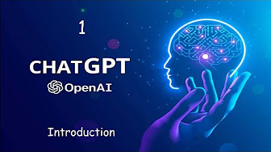

# Nodejs ChatGPT ChatBot

This repository contains a backend chatbot project based on the ChatGPT `gpt-3.5-turbo` model.

ChatBot - ChatGPT:  

## Dependencies
* [OpenAI](https://openai.com/)
* [ChatGPT](https://platform.openai.com/)
* [Readline](https://nodejs.org/api/readline.html)
* [Nodejs](https://nodejs.org/en)

## Installation
* Clone this repo `https://github.com/girlCoder8/nodejs-chatgpt`
* Navigate into the repo `cd nodejs-chatgpt`
* Install the dependencies ``npm install``
* Run the `index.js` file `node index`

*That will open a prompt in the terminal for you to type a message. It will continue until you decide to terminate the chat using `Control + C`*